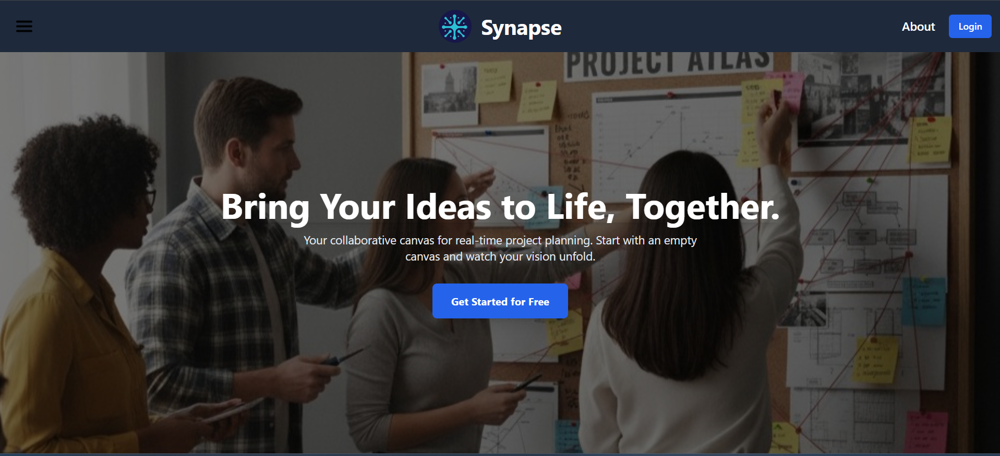
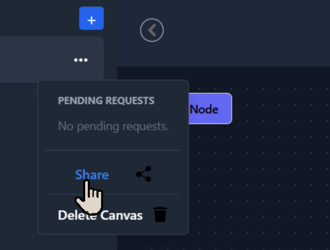
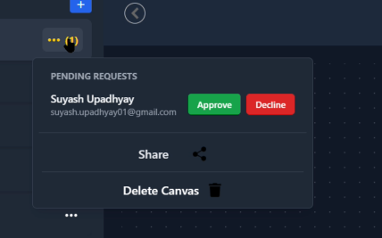
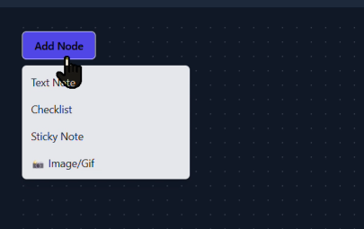
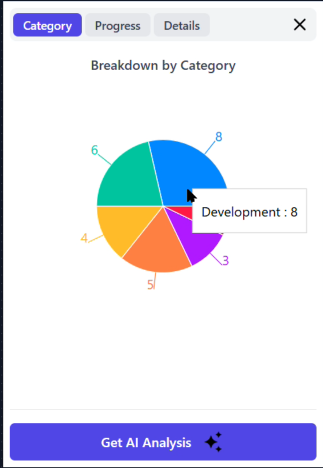
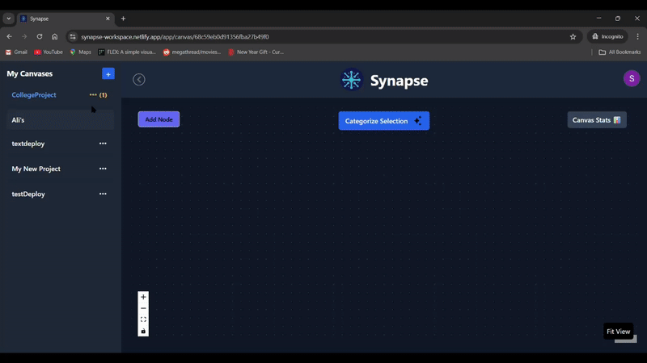
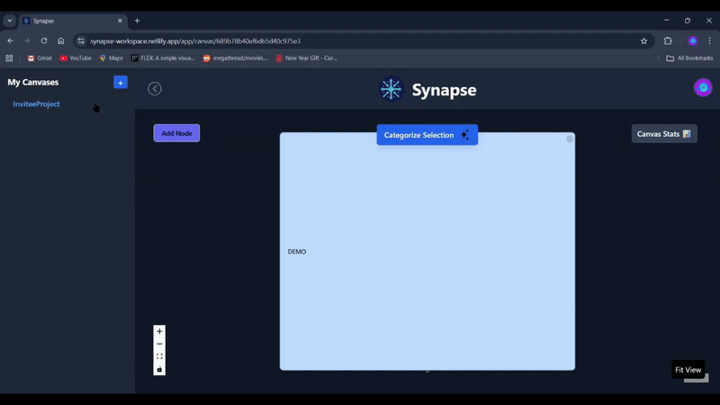

#  Synapse
### AI-Powered Real-Time Collaboration Workspace

> **Transform scattered ideas into structured, collaborative plans with real-time intelligence**

[](https://www.typescriptlang.org/)
[](https://reactjs.org/)
[](https://nodejs.org/)
[](https://firebase.google.com/)
[](https://www.mongodb.com/)
[](https://www.netlify.com/)

---

## **Project Overview**

Synapse is a cutting-edge visual workspace application designed to solve the fundamental problem of **"organizing the chaos of creativity."** Built for individuals and teams who need to transform scattered ideas into structured, actionable plans, Synapse combines real-time collaboration with AI-powered intelligence to deliver unprecedented project insights and organization capabilities.

### **Key Problem Solved**
- **Before Synapse**: Ideas scattered across multiple tools, poor collaboration, lack of project intelligence
- **After Synapse**: Unified visual workspace with real-time collaboration and AI-driven project analysis

---

##  **Core Features**

### ** Visual Collaboration Engine**
- **Infinite Zoomable Canvas**: Unlimited workspace with persistent nodes and edges
- **Real-Time Synchronization**: Instant CRUD operations via Firestore with live user presence
- **Multiple Node Types**: Text blocks, checklists, sticky notes, and image nodes
- **Secure Sharing System**: Invite-based collaboration with comprehensive permission management

### ** Intelligence Suite (AI-Powered)**
- **Magic Tagger**: Automated node categorization using Hugging Face ML model
- **Snapshot Dashboard**: Interactive analytics with dynamic charts and canvas statistics
- **AI Project Analyst**: Google Gemini-powered co-pilot providing project summaries, risk analysis, and actionable recommendations

---

##  **Technical Architecture**

### **Full-Stack TypeScript Monorepo**
```
synapse-monorepo/
├── client/          # React + TypeScript frontend
├── server/          # Express + TypeScript backend
└── netlify.toml     # Serverless deployment configuration
```

### **Frontend Stack**
- **Framework**: React 19 with TypeScript, built with Vite
- **UI Libraries**: ReactFlow (canvas), Recharts (analytics), Tailwind CSS
- **State Management**: Custom React hooks, TanStack Query, React Context
- **Authentication**: Firebase Authentication SDK

### **Backend Stack**
- **Runtime**: Node.js with Express, serverless-compatible architecture
- **Authentication**: Firebase Admin SDK for secure token verification
- **API Design**: RESTful endpoints with custom controllers and services
- **Deployment**: Netlify Functions for serverless execution

### **Database Strategy**
- **MongoDB**: Primary database for permissions, metadata, and core application data
- **Google Firestore**: Real-time collaborative state engine for live synchronization
- **Dual Database Architecture**: Optimized for both persistence and real-time performance

---

## 🛠️ **Technology Stack**

| Category | Technology | Purpose |
|----------|------------|---------|
| **Frontend** | React 19, TypeScript, Vite | Modern UI development |
| **Backend** | Node.js, Express, TypeScript | API and business logic |
| **Real-time** | Google Firestore | Live collaboration |
| **Database** | MongoDB | Data persistence |
| **Authentication** | Firebase Auth | Secure user management |
| **AI/ML** | Hugging Face, Google Gemini | Intelligence features |
| **Visualization** | ReactFlow, Recharts | Canvas and analytics |
| **Styling** | Tailwind CSS | Responsive design |
| **Deployment** | Netlify Functions | Serverless hosting |
| **State Management** | TanStack Query, React Context | Client-side state |

---

## **Getting Started**

### **Prerequisites**
- Node.js 18+ and npm
- MongoDB instance
- Firebase project with Authentication and Firestore
- Google Gemini API key
- Hugging Face API access

### **Quick Start**

1. **Clone and Install**
   ```bash
   git clone https://github.com/yourusername/synapse
   cd synapse
   npm install
   ```

2. **Environment Setup**
   ```bash
   # Client environment
   cp client/.env.example client/.env
   
   # Server environment
   cp server/.env.example server/.env
   ```

3. **Development Mode**
   ```bash
   # Start both client and server
   npm run dev
   
   # Or individually
   npm run dev:client
   npm run dev:server
   ```

4. **Production Build**
   ```bash
   npm run build
   ```

---


### **Real-Time Collaboration Demo**


## ** Multi-user simultaneous editing → Live drag & drop → Text updates → Node resizing → All synchronized instantly**

---


##  **Features Showcase**

### **Professional Landing & Dashboard**


*Clean, professional interface with intuitive navigation and canvas management*

### **Canvas Management & Sharing**


*Organized canvas sidebar with dropdown sharing controls and delete options*

### **Secure Collaboration System**


# *Smart notification system showing user details (name, email) with accept/decline options*

### **Multi-Modal Node Creation**


*Comprehensive node system: Text, Checklists, Sticky Notes, and Image nodes with creation dropdown*

### **AI-Powered Smart Categorization**


## *Watch AI automatically categorize and tag nodes based on content analysis*


--
### **Intelligence Suite - Analytics Dashboard**

#### **Snapshot Overview**


*Real-time pie chart showing distribution of categorized nodes*

#### **Checklist Analytics**


*Interactive bar graphs showing:*
- *Overall completion rates across all checklist nodes*
- *Individual checklist breakdown with complete/incomplete tasks*

### **AI Project Analyst**


*Google Gemini-powered insights providing project summaries, risk analysis, and actionable recommendations*

---

##  **Complete Workflow Demonstration**

*Experience the full collaborative journey from canvas creation to real-time editing*

### **1️⃣ Canvas Creation & Sharing**


**Step 1:** *Create new canvas → Add initial content nodes → Open share dropdown → Generate secure invite link*

### **2️⃣ Secure Invitation System**


**Step 2:** *Share invite link → Access request notification → User authentication and permission request*

### **3️⃣ Smart Access Control**


**Step 3:** *Review collaboration requests → User details verification → Accept or decline access permissions*

### **4️⃣ Seamless Canvas Access**


**Step 4:** *loading canvas → Ready for collaborative editing*


---

##  **AI Intelligence Suite**       

### **Smart Content Categorization*


*Select multiple nodes → AI analysis via Hugging Face → Automatic intelligent tagging → Organized workspace*

### **Analytics Dashboard**


*Real-time canvas insights → Interactive pie charts → Checklist completion tracking → Project health metrics*

---

##  **Use Cases**

- **Product Teams**: Feature planning, user journey mapping, sprint planning
- **Designers**: Mood boards, design systems, collaborative wireframing  
- **Educators**: Interactive lesson planning, collaborative learning spaces
- **Consultants**: Client workshops, strategy sessions, project visualization
- **Developers**: System architecture, API design, technical documentation

---

## **Performance & Scale**

- **Real-time Updates**: Sub-100ms synchronization across clients
- **Serverless Architecture**: Auto-scaling based on demand
- **Optimized Database**: Dual-database strategy for performance and consistency
- **Modern Stack**: Built with latest React 19 and TypeScript for maintainability

---


## 👤 **Author**

**Suyash Upadhyay**

- LinkedIn: [Suyash Upadhyay](https://www.linkedin.com/in/suyash-upadhyay-49554b333/)
- Email: suyash.upadhyay01@gmail.com

---

<div align="center">

**⭐ Heres a link to live demo**

[Live Demo](https://synapse-workspace.netlify.app) 

</div>